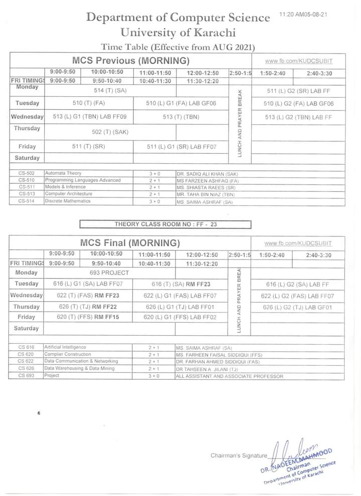

### Semester 2 of MCS 2021

#### Links
* CS-502
    * [Theory](../semester_2/CS_502_Automata_Theory/theory)
    * [Class Work](../semester_2/CS_502_Automata_Theory/classwork)
* CS-510
    * [Lab](../semester_2/CS_510_Programming_Languages_Advanced/lab)
    * [Theory](../semester_2/CS_510_Programming_Languages_Advanced/theory)
    * [Class Work](../semester_2/CS_510_Programming_Languages_Advanced/classwork)
* CS-511
    * [Lab](../semester_2/CS_511_Models_And_Inference/lab)
    * [Theory](../semester_2/CS_511_Models_And_Inference/theory)
    * [Class Work](../semester_2/CS_511_Models_And_Inference/classwork)
* CS-513
    * [Lab](../semester_2/CS_513_Computer_Architecture/lab)
    * [Theory](../semester_2/CS_513_Computer_Architecture/theory)
    * [Class Work](../semester_2/CS_513_Computer_Architecture/classwork)
* CS-514
    * [Theory](../semester_2/CS_514_Discrete_Mathematics/theory)
    * [Class Work](../semester_2/CS_514_Discrete_Mathematics/classwork)

#### Schedule

#### Course Details

| Course Code | Course Name | Credit Hrs. |
|-------------|:-------------:|:-------------:|
| CS-502 | Automata Theory | 3 + 0 |
| CS-510 | Programming Languages Advanced | 2 + 1 |
| CS-511 | Models & Inference | 2 + 1 |
| CS-513 | Computer Architecture | 2 + 1 |
| CS-514 | Discrete Mathematics | 3 + 0 |

#### CS-502: Automata Theory
#### Credit Hour (3 + 0)

Set notation properties and operation. Relations, Properties of Relations, Equivalence of Relations, Closure of Relations, Graph and tree Notations.
Sequential circuits, Synthesis of Synchronous Sequential circuits. Transition diagram. Finite state machines. machines. Moore & Mealy machine. Capabilities & Limitation of finite state machine, state equivalence  & Machine Minimization. Simplification of Incompletely  specified machine. Interactive networks.
Fundamental Mode Circuits. State Assignment in Asynchronous Sequential circuits. Plus Mode Circuits.
State assignment using partitioning lattice of closed partitions over & generation of closed partitions. Information flow in sequential machines. Decomposition & Synthesis.
Experiments; Homing Experiments, Distinguishing Experiments Machine. Identification Experiment, Fault detection experiment. Design of diagnosable machine.
Finite memory machines, Definite machines, memory span  w.r.t. output sequence information less machine.
Inert Linear Machine, Insert Linear Machine & rational. Transfer function, General Model Reduction of  Linear Machines. Identification of Linear Machine, Application of Linear Machine to error correction.
Deterministic Recognizers, Transition Graph, Converting Non-deterministic to deterministic graphs. Regular expression. Transition graphs, Recognizing Regular sets, Regular sets corresponding to Transition graphs. Two way Recognizer.

#### Recommended Books:
    
    Zui-Cohavi. Sequential Circuits and Finite Automata Theory Tata. McGraw Hill.
    Abrahem Kendel, Fuzzuy Switching Automata; Theory and Application. Gamnee C. Lu.
    Arther Dfrje Dman Fremachandran R. Me. Theory and Design of  Switching Circuits. John Willey &  Co., New York.

#### CS-510:  Programming Languages Advanced
#### Credit Hour (2 + 1)

Numbers, Arithmetic & Variables, Decision & Contract, loop control, Input types, Output types sets of variables, subprograms (basic & details), Logical values, character values, Magnetic tape Input Output.

#### Recommended Books:

    J. B. Moore, & L. J. Makela. (1978) Structure FORTRAN with WATFIV. Reston Publishing Co. Virginia.
    Cress, P; Darksen. P; Grham, J. W. (1970). FORTRAN IV, with WATIV Prinstorn Hall. Inc.
    Gotfried, B.S. (1972) Programming with FORTRAN-IV (1972). Quantum Publishers, N. Y.

#### CS-511:  Models and Inference
#### Credit Hour (2 + 1)

Statistical models and random samples; informal methods of checking models; Estimation an prediction; Methods of Maximum likelihood and  Least squares, and their applications within the frame-work of programming.

#### Recommended Books:

    M. Atiqullah. (1988). Basic Statistics with Computer Role. Kifayat Academy, Karachi.
    J. S. Milton & Jesse C. Arnold. (1986) Probability and Statistics in the Engineering and Computer Science. McGraw Hill.

#### CS-513:  Computer Architecture
#### Credit Hour (2 + 1)

Architecture Attributes, Organization Attributes, Architectural Development (History), Machine Compatibility v/s Program Behavior. Flynn’s Classification of Computer Architecture (SISD, SIMD, MISD, MIMD Architectures), Shared v/s Distributed Memory Architecture under MIMD classification, Tightly coupled and Loosely couples systems, Bernstein’s conditions. Two state logic, Performance measurement of commuter system (MIPS, MFLOPS and Throughput calculations), Common bus architecture, Logic families and their characteristics (TTL, MOS & ECL), Interfacing of various logic families. Difference b/w Microprocessors and Microcontrollers architectures, Open Architecture v/s Close Architectures, CISC, RISC, Single Task & Super-Scalar (K-Issue) Processors, WINTEL Architecture. CPU performance factors (1. Clock-speed, 2.Bus-sizes, 3.Numeric processors, 4. Micro-Code efficiency, 5. Cache Memories, L1,L2,L3), Pentium Cache Organization, Pipeline Architectures.  Designing of Program-Counter, Memory Address Register, Instruction Register, Control Unit (Control Matrix, Microprogrammed), ALU, etc. Micro v/s Macro Instructions. Development of Assembly language. Variable Machine Cycles.

#### Recommended Books:

    M.Moris Mano. Computer System Architecture.
    William Stalling.  Computer Organization and Architecture.
